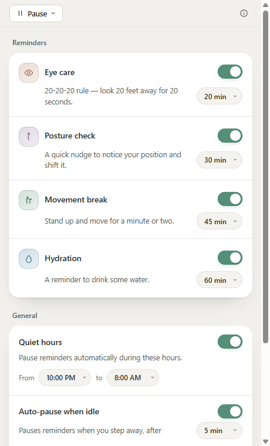
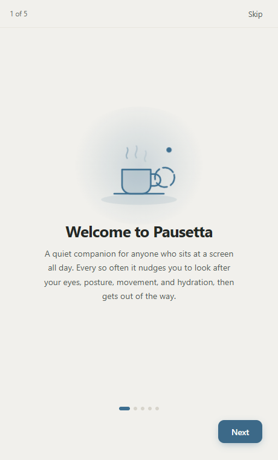
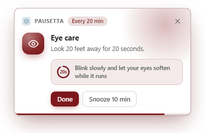

<div align="center">


# Pausetta: gentle break reminders for your eyes, posture, movement, and hydration

**A free, open-source desktop break reminder for Windows, macOS, and Linux.**
It sits in your system tray and reminds you to rest your eyes, fix your posture,
stand up, and drink some water.

[](https://github.com/MasihTak/Pausetta/actions/workflows/test.yml)
[](https://github.com/MasihTak/Pausetta/actions/workflows/release.yml)
[](./LICENSE)
[](#installation)
[](https://tauri.app)

</div>

---

> *Pausetta* is Italian for a short break, the diminutive of *pausa*. The `-etta` is the
> whole pitch: something small that doesn't get in your way.

## Contents

- [Why I built Pausetta](#why-i-built-pausetta)
- [Screenshots](#screenshots)
- [What makes it different](#what-makes-it-different)
- [Features](#features)
- [The research behind the defaults](#the-research-behind-the-defaults)
- [Installation](#installation)
- [Configuration](#configuration)
- [How it works](#how-it-works)
- [Development](#development)
- [FAQ](#faq)
- [Contributing](#contributing)
- [License](#license)

## Why I built Pausetta

### The problem

Ten hours a day in front of a screen costs you something, and it's the kind of cost that
arrives slowly enough to ignore. Dry, tired eyes by mid-afternoon. A stiff neck and a lower
back that complains when you finally stand up. Six hours in the chair without once getting
out of it. A glass of water sitting full next to the keyboard.

None of it is hard to fix. Look away from the screen for twenty seconds. Sit differently.
Walk to the kitchen. Drink the water. These things are free, they take a minute, and
ergonomics research has backed them for decades.

Remembering is the hard part. Being deep in a problem is exactly when you stop noticing your
body, so the more focused you are, the more you need a nudge you're least likely to give
yourself.

### Why the existing apps didn't stick

I installed a few of them over the years and removed all of them, usually for one of two
reasons.

Some were heavy. An Electron app idling at a few hundred megabytes so it can pop a
notification every twenty minutes is a bad trade on a machine that's already running a
compiler, a browser and a pile of containers.

The rest were just annoying. Full-screen lockouts you have to click through, streaks that
guilt you for having a busy week, a sound you can't turn off, the same reminder again thirty
seconds later because you didn't obey it the first time. An app like that gets uninstalled
within a week, and then you're back to no reminders at all.

There's a third failure that's worse, because it's silent: the app that quietly stops
reminding you. Timers built on JavaScript intervals drift, get throttled when their window is
hidden, and give up entirely when the machine sleeps. You notice on Thursday that nothing has
fired since Tuesday.

### What Pausetta does instead

It's the version I wanted: small, quiet, and boring enough to leave running for a year.

The scheduler is Rust and works on absolute timestamps, so shutting the lid, sleeping for
four hours or leaving the machine up for a month doesn't break it. Waking up doesn't dump a
stack of overdue reminders on you either; anything that came due while you were away is
skipped to its next turn.

It's a native Tauri app with no window open at launch. It boots to the tray and stays there.

Ignoring a reminder costs you nothing. There's no streak to break, no score, no confirmation
dialog, and nothing fires again thirty seconds later. Pause is one click away in the tray,
quiet hours are on by default, and the reminders stop on their own when you walk away from
the keyboard.

The intervals and the wording come from published research, and where that research is shaky
(it genuinely is for the 20-20-20 rule) the app says so rather than selling you certainty it
doesn't have.

Nothing leaves your machine. No account, no sync, no telemetry, no network calls at all. Your
settings are a SQLite file in your own app data directory, and the source is right here.

### Who it's for

Anyone whose work keeps them in a chair and in front of a screen well past the point where
they notice: developers, designers, writers, students, gamers, office workers. It's most
useful if you already know you should take breaks and simply don't.

## Screenshots

| Settings | Onboarding |
| :---: | :---: |
|  |  |

<div align="center">



*An eye care reminder, with the 20-second timer running.*

</div>

## What makes it different

**No gamification.** No streaks, badges, points or scores. Streak mechanics punish you for a
busy week, and they're one of the main reasons health apps get uninstalled.

**No dashboard.** There's no main window and no stats screen. Pausetta is a background
process, not an app you open.

**Nothing leaves the machine.** No account, no cloud, no telemetry. Settings live in a local
SQLite file and the app works offline.

**Reminders that survive real life.** The Rust scheduler works on timestamps rather than
JavaScript countdowns, so sleep, hibernation and weeks of uptime don't quietly break it.

**Dismissal is free.** No confirmation dialogs, no shame copy, no re-nagging. Pause is always
one click away in the tray, because people only trust a tool they can turn off easily.

## Features

### Four independent reminder categories

Each one toggles separately and has its own interval. They aren't one generic "take a break"
timer wearing four hats.

| Category | Default | What the reminder says |
| --- | --- | --- |
| 👁️ **Eye care** | 20 min | Look 20 feet away for 20 seconds (the 20-20-20 rule) |
| 🧍 **Posture** | 30 min | Notice your position and shift it |
| 🚶 **Movement** | 45 min | Stand up and move for a minute or two |
| 💧 **Hydration** | 60 min | Time to drink some water |

Intervals are picked from 15 / 20 / 30 / 45 / 60 minutes.

### Behaviour

- **Quiet hours.** A window where nothing fires at all. Defaults to 22:00–08:00.
- **Idle auto-pause.** The countdown stops while you're away from the keyboard and restarts
  when you come back, so nothing fires the second you sit down.
- **Sleep and wake handling.** A long gap between ticks is treated as a machine sleep, and
  anything overdue waits for its next cycle instead of firing all at once.
- **Manual pause.** Pause 1 hour, Pause today, or Resume, straight from the tray menu.
- **Snooze.** Pushes one reminder back 10 minutes. Its normal interval picks up afterwards.
- **No pile-ups.** If two categories come due in the same second, the second one waits a
  minute rather than landing on top of the first.
- **Launch on login.** Optional, on all three platforms.
- **Optional sound.** Off by default, and it plays your configured system notification sound
  rather than some asset of ours.
- **Light and dark mode**, following the OS.
- **Tray only.** No window at launch, no dock or taskbar icon.

## The research behind the defaults

Every default interval and every line of reminder copy traces back to published research, and
none of it is dressed up as more settled than it is. Workplace and ergonomics research rarely
proves that one exact number is right. It shows a direction and a plausible range. Read the
intervals below as sensible defaults grounded in the best available evidence, not as
clinically validated prescriptions.

**None of this is medical advice.**

| Category | Default | Evidence strength |
| --- | --- | --- |
| **Eye care** | 20 min | Contested. The mechanism is sound, the exact numbers aren't validated |
| **Posture** | 30 min | Mechanism strong, specific interval unstudied |
| **Movement** | 45 min | Strong. Cohort, controlled and meta-analytic evidence agree |
| **Hydration** | 60 min | Moderate. Clearer for mood and concentration than for raw cognitive scores |

### Eye care and the 20-20-20 rule

The most-cited and least-settled of the four. It stays the default here because it's
memorable, costs nothing and points in a sensible direction, but the app words it as a
helpful habit rather than a cure. A 2023 controlled study ([Johnson & Rosenfield, *Optometry
and Vision Science*](https://pubmed.ncbi.nlm.nih.gov/36473088/)) tested 20-second breaks at
5, 10, 20 and 40-minute intervals and found that break frequency made no significant
difference to symptoms, reading speed or accuracy. Other work points the other way: a
[break-reminder field study](https://www.sciencedirect.com/science/article/pii/S1367048422001990)
found improvements in tear break-up time among symptomatic computer users.

The underlying mechanism is on firmer ground. [Blink rate drops significantly during screen
use](https://pmc.ncbi.nlm.nih.gov/articles/PMC9434525/), which destabilises the tear film,
and sustained near-focus tires the eye's accommodative muscles. Any break that gets you
blinking and changes your focal distance helps with that, whatever the exact timing.

### Posture

There's no 20-20-20 equivalent for posture in the literature. The mechanism is solid:
forward-head posture measurably loads the cervical spine, and a [systematic
review](https://pmc.ncbi.nlm.nih.gov/articles/PMC8959976/) consistently associates static,
prolonged computer work with neck and shoulder disorders. What the evidence supports is
periodic *change* of position rather than one "correct" posture held for hours. A [pilot study
of a dynamic workstation](https://www.ncbi.nlm.nih.gov/pmc/articles/PMC7915059/) found
improvements in neck pain and strength from encouraging variation. That's why the reminder
says "notice your position and shift it" instead of "sit up straight", and why its cue follows
the ANSI/HFES 100 guidance of a monitor slightly below eye level.

### Movement and breaking up sitting time

The best-supported category by some distance. A large accelerometer cohort study (Diaz et
al., roughly 8,000 adults aged 45+) found the lowest mortality risk among sedentary adults who
broke up their sitting at least every 30 minutes. [Uninterrupted sitting bouts over about an
hour](https://pmc.ncbi.nlm.nih.gov/articles/PMC3651291/) are independently linked to worse
cardiometabolic markers even at the same total sedentary time, so the pattern matters and not
just the total. A [systematic review of active
microbreaks](https://www.tandfonline.com/doi/full/10.1080/23311916.2022.2026206) (1–3 minutes
of light activity every 20–30 minutes) found reduced musculoskeletal discomfort with no
measurable cost to productivity, which is worth knowing if you're worried about the
interruption. A [2025 meta-analysis of computer-prompt
interventions](https://www.ncbi.nlm.nih.gov/pmc/articles/PMC12164069/), meaning apps like this
one, found an average reduction of around 12.5 minutes of sitting per workday at
low-to-moderate certainty.

### Hydration

Reasonably supported for mild dehydration, around 1–2% body mass loss, which is easy to reach
without noticing. The findings are more consistent for mood than for objective cognitive
scores. [Armstrong et al.
(2012)](<https://jn.nutrition.org/article/S0022-3166(22)02889-9/fulltext>) found that mild
dehydration significantly worsened vigor, fatigue and perceived task difficulty while most
objective test scores held steady, and a [2-year prospective cohort
study](https://link.springer.com/article/10.1186/s12916-023-02771-4) linked poorer
physiological hydration status to greater decline in global cognitive function. Mood and
perceived effort happen to be what you care about during a long working session, so a plain
"drink some water" needs no overstatement to earn its place.

## Installation

Pausetta is in beta. Grab the installer for your platform from the
[**Releases page**](https://github.com/MasihTak/Pausetta/releases) and run it.

| Platform | Package | First-run note |
| --- | --- | --- |
| **Windows** | `.msi` / `.exe` | Unsigned builds trip SmartScreen. Choose **More info → Run anyway**. |
| **macOS** | `.dmg` | Unsigned builds are Gatekeeper-blocked, so **right-click → Open**. Idle detection needs Accessibility permission. |
| **Linux** | `.AppImage` / `.deb` | Reminders are drawn by the app itself, so they work even without a notification daemon. |

Once it's running, look for the Pausetta icon in your tray. There's no window and no taskbar
entry, which is the point, so the first run opens a short walkthrough that points you at it.

## Configuration

It's one compact Settings panel, opened from the tray:

- Per-category toggle and interval (15 / 20 / 30 / 45 / 60 minutes)
- Quiet hours, on half-hour boundaries
- Idle auto-pause threshold (3 / 5 / 10 / 15 / 30 minutes)
- Launch on login
- Notification sound

Settings are stored in a SQLite database in your OS application-data directory:
`%APPDATA%\com.masihtak.pausetta` on Windows, `~/Library/Application
Support/com.masihtak.pausetta` on macOS, `~/.local/share/com.masihtak.pausetta` on Linux.
Delete that file and you're back to defaults.

## How it works

The one architectural decision everything else follows from: the scheduler lives in Rust, not
in the webview. `setInterval` drifts, gets throttled when the window is hidden, and falls over
across system sleep. Since a reminder app that silently stops reminding you is worse than no
app at all, the frontend is only ever a UI over state the Rust core owns and persists. It
never decides when a reminder fires.

```
┌──────────────────────────────────────────────────┐
│  Vue 3 + Pinia                                   │
│  Settings · About · Reminder toast               │
└───────────────────────┬──────────────────────────┘
                        │  Tauri commands / events
┌───────────────────────▼──────────────────────────┐
│  Rust core (tokio)                               │
│                                                  │
│  ┌────────────────────┐  ┌────────────────────┐  │
│  │ Scheduler          │  │ Idle detector      │  │
│  │ next_trigger_at    │  │ pauses the count   │  │
│  └────────────────────┘  └────────────────────┘  │
│                                                  │
│  ┌────────────────────────────────────────────┐  │
│  │ Persistence: SQLite via rusqlite           │  │
│  └────────────────────────────────────────────┘  │
└───────────────────────┬──────────────────────────┘
                        │
┌───────────────────────▼──────────────────────────┐
│  OS integrations                                 │
│  Tray icon · Autostart · System sound            │
└──────────────────────────────────────────────────┘
```

Each category stores a `next_trigger_at: DateTime<Utc>` timestamp rather than a countdown. One
tokio task ticks about once a second and compares `now` against each stored instant, which is
what makes sleep and wake correct without any special handling: after a four-hour sleep, `now`
has simply moved. An unusually large gap between ticks is read as a wake, and every overdue
category gets pushed to its next cycle instead of firing.

The Rust side is layered. Tauri `#[command]` functions are thin controllers that delegate to
service structs (`SettingsService`, `SchedulerService`), which sit behind a
`SettingsRepository` trait with a SQLite implementation. `rusqlite` was chosen over
`tauri-plugin-sql` because that plugin hands SQL to the JavaScript side, and the whole point
here is that Rust owns persistence and can be tested against an in-memory database.

### Tech stack

| Concern | Choice |
| --- | --- |
| Shell | [Tauri v2](https://tauri.app) |
| Core | Rust + tokio |
| Frontend | [Vue 3](https://vuejs.org) + Pinia + SCSS |
| Storage | SQLite (`rusqlite`, bundled) |
| Idle detection | `user-idle` |
| Package manager | pnpm |
| Tests | Vitest + `@vue/test-utils`, `cargo test` |
| CI / releases | GitHub Actions + `tauri-action` |

## Development

You'll need [Node.js](https://nodejs.org) 24.16 or newer, [pnpm](https://pnpm.io) 11.9+, a
[Rust toolchain](https://rustup.rs), and your platform's [Tauri v2
prerequisites](https://v2.tauri.app/start/prerequisites/).

```bash
git clone https://github.com/MasihTak/Pausetta.git
cd Pausetta
pnpm install
pnpm tauri dev        # full app: Rust core + Vue webview
pnpm dev              # frontend only, no Rust backend, Tauri commands unavailable
pnpm test             # Vitest suite
pnpm test:coverage    # ...with v8 coverage (80% thresholds enforced)
pnpm lint             # ESLint
pnpm tauri build      # bundle → src-tauri/target/release/bundle/
```

```bash
cd src-tauri
cargo check           # fast compile check
cargo test            # Rust suite
```

Reach for `pnpm tauri dev` rather than `pnpm dev` for anything that touches a Tauri command,
since the frontend-only server has no Rust behind it. Both suites run on every pull request.

## FAQ

**Does Pausetta send any data anywhere?**
No. There's no account, no sync, no telemetry and no network dependency. Settings live in a
local SQLite file and the app works offline.

**Will it interrupt me during games, presentations or video calls?**
It might. Pausetta doesn't detect fullscreen or Do Not Disturb yet, so a reminder can appear
over a game or a call. Pause 1 hour and Pause today are one click away in the tray in the
meantime.

**Why doesn't it use native OS notifications?**
Reminders are drawn as a small custom window instead, which keeps the look and the timing the
same everywhere and keeps them working on Linux setups where the notification daemon is
inconsistent or missing.

**Where's the main window?**
There isn't one, on purpose. Pausetta boots to the tray with no dock or taskbar icon. Settings
and About open from the tray menu and are created on first use, and closing Settings hides it
rather than destroying it, so it reopens instantly.

**Can I change the intervals?**
Yes. Every category is independently toggleable with its own interval, picked from 15, 20, 30,
45 or 60 minutes.

**How is this different from a Pomodoro timer?**
A Pomodoro timer structures your work into focus blocks you commit to. Pausetta asks for no
commitment at all. It runs in the background on four physical-health intervals and can be
ignored without breaking anything.

**Is this medical advice?**
No. The defaults are grounded in published research, but they're defaults rather than
individually validated numbers, and none of it replaces a clinician.

## Contributing

Contributions are welcome. [`CONTRIBUTING.md`](./CONTRIBUTING.md) covers setup, the
[Conventional Commits](https://www.conventionalcommits.org/) convention this repo enforces and
the PR checklist. [`CODE_OF_CONDUCT.md`](./CODE_OF_CONDUCT.md) applies to everyone taking part.

Found a security issue? Please follow [`SECURITY.md`](./SECURITY.md) instead of opening a
public issue.

## License

[GPL-3.0-only](./LICENSE). Use it, modify it and redistribute it freely, but any modified
version you distribute has to be GPL-3.0 as well, with its source available.
